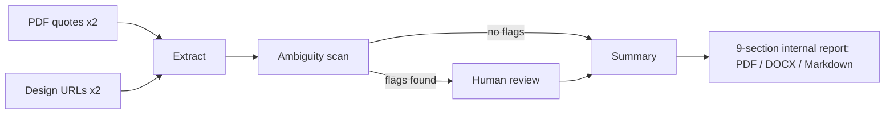

# Quote Comparison Agent

A human-in-the-loop LLM application that compares a competitor builder's quote against the equivalent quote from a residential construction company, flags ambiguous inclusions before they distort the comparison, and produces a structured internal summary for the sales team.

Built for a real sales workflow: a rep receives a competitor quote from a prospective customer and needs to know, line by line, where the company's offer is stronger, where it has gaps, and which comparisons cannot be made honestly without more information. The system's defining behaviour is that it refuses to compare ambiguous items — a competitor line reading "downlights included" with no quantity is flagged and routed to a human before any dollar comparison is drawn, because comparing $0 against a fully-specified $1,606 electrical pack would be confidently wrong.

The application is a Streamlit multi-page app in [`quote-comparison-agent/`](quote-comparison-agent/).

## Architecture at a glance

**Orchestration pattern: sequential pipeline with a human-in-the-loop gate.** The primary path runs extract → ambiguity scan → *pause for human review* → summary as ordered LLM calls, each returning JSON validated against Pydantic schemas. An alternate execution mode (active when `LLM_PROVIDER=openai`) wraps the same three steps as function tools under a single manager agent built on the OpenAI Agents SDK. There is no multi-agent fan-out; the design is deliberately linear because each step consumes the validated output of the previous one, and the ambiguity gate must be able to stop the line.

- **Models:** Anthropic Claude (primary, via the `anthropic` SDK), OpenAI (fallback and Agents SDK mode, via the `openai` SDK). Provider selection is environment-driven with a deterministic fallback order: explicit `LLM_PROVIDER` → Anthropic key present → OpenAI key present → demo fixtures.
- **Memory / session state:** Streamlit `st.session_state`, initialised from a single `SESSION_DEFAULTS` map. Each comparison gets a fresh `QCP-<date>-<hex>` session id; there is no cross-session persistence by design (comparisons are isolated).
- **Retrieval:** live URL fetch per run — Tavily Extract API when a key is configured, otherwise direct `httpx` + BeautifulSoup readability cleanup. No caching, no vector store; grounding comes from the four uploaded/fetched source materials only.
- **Demo mode:** with no API keys (or `LLM_PROVIDER=demo`) the pipeline runs end to end on rich fixtures, including the canonical downlights-ambiguity case, so the full human-review flow is demonstrable offline.



## Quickstart

```bash
git clone <this-repo> && cd <this-repo>/quote-comparison-agent
python3 -m venv .venv
source .venv/bin/activate          # Windows: .venv\Scripts\activate
pip install -r requirements.txt
cp .env.example .env               # add keys, or leave blank for demo mode
streamlit run streamlit_app.py
```

Expected output: Streamlit prints `Local URL: http://localhost:8501`; the browser opens on the Home page with a "Start a comparison" button. The sidebar footer shows the active provider (`LLM: ANTHROPIC`, `OPENAI`, or `DEMO`). With no keys configured, walk New Comparison → Processing → Review → Summary entirely on fixtures.

## Configuration

All variables are read from `quote-comparison-agent/.env` (loaded by `config.py` before any page imports).

| Variable | Required | Purpose | Where to get it |
|---|---|---|---|
| `ANTHROPIC_API_KEY` | No¹ | Primary reasoning provider | console.anthropic.com |
| `ANTHROPIC_MODEL` | No | Anthropic model id (code default: `claude-sonnet-4-6`) | Anthropic model list |
| `OPENAI_API_KEY` | No¹ | Fallback provider; enables the Agents SDK mode | platform.openai.com |
| `OPENAI_MODEL` | No | OpenAI model id (default: `gpt-4o`) | OpenAI model list |
| `LLM_PROVIDER` | No | Force `anthropic`, `openai`, or `demo`; unset resolves by key presence | — |
| `TAVILY_API_KEY` | No | URL extraction via Tavily; blank falls back to direct fetch | tavily.com |
| `SESSION_TTL_MINUTES`, `APP_NAME`, `APP_BRAND`, `GIT_TOKEN` | No | Declared in `.env.example` but **not read by any code at present** | — |

¹ With neither key set the app runs in demo mode on fixtures.

## Documentation

- [docs/ARCHITECTURE.md](docs/ARCHITECTURE.md) — component map, data flow, orchestration and state analysis, design decisions, extension paths.
- [docs/EVALUATION.md](docs/EVALUATION.md) — what automated verification exists today (plainly: none), edge cases the code handles, and a proposed evaluation harness.
- [docs/HARDENING.md](docs/HARDENING.md) — current security posture and a staged ladder to production.

## Repository notes

Code identifiers and UI strings retain the naming from the original engagement (the construction company, named competitor builders, and the delivery brand theme in `theme/fusion5.css`). Documentation refers to these parties generically; the code is untouched.
